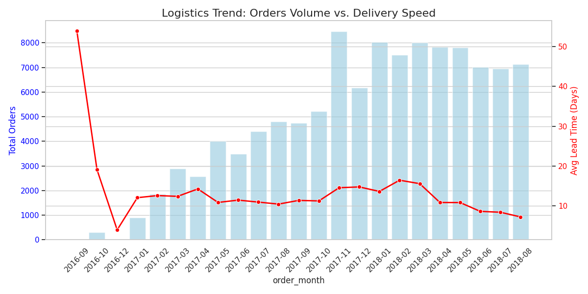
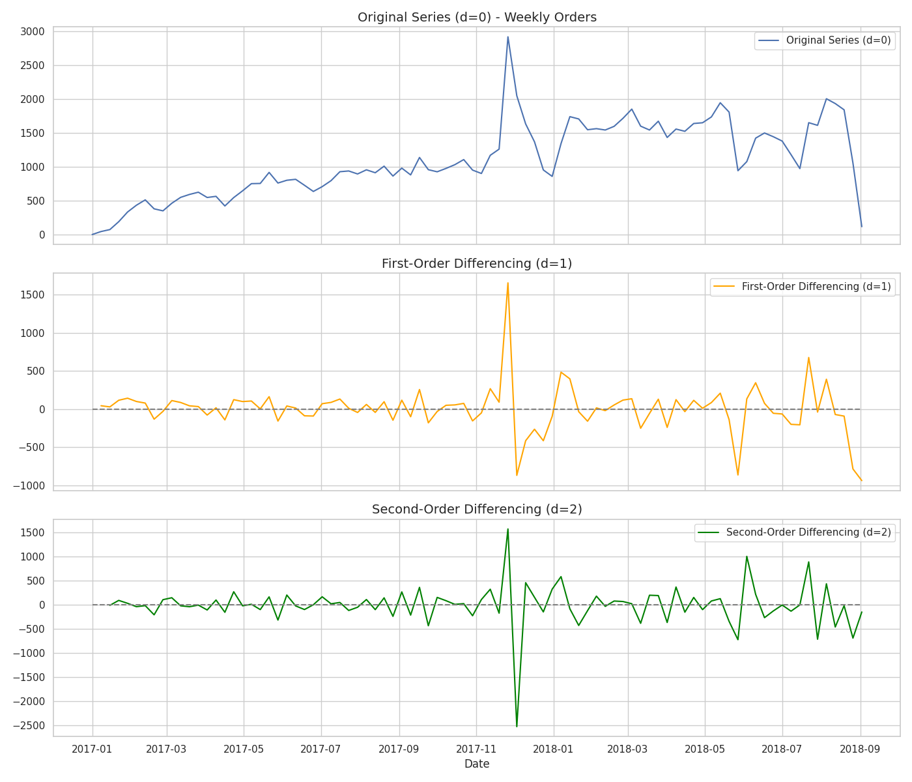
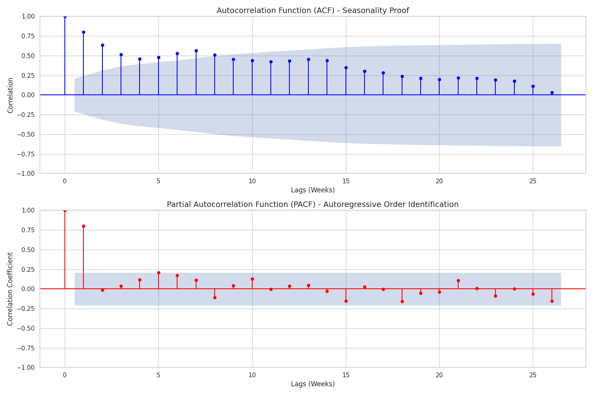
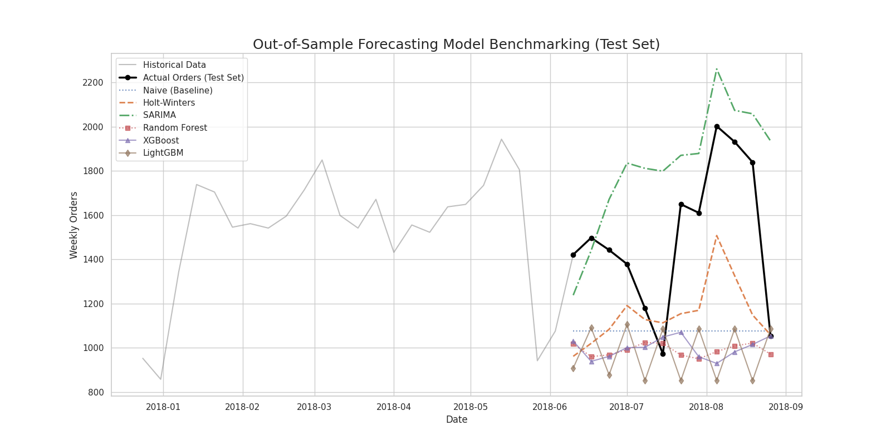
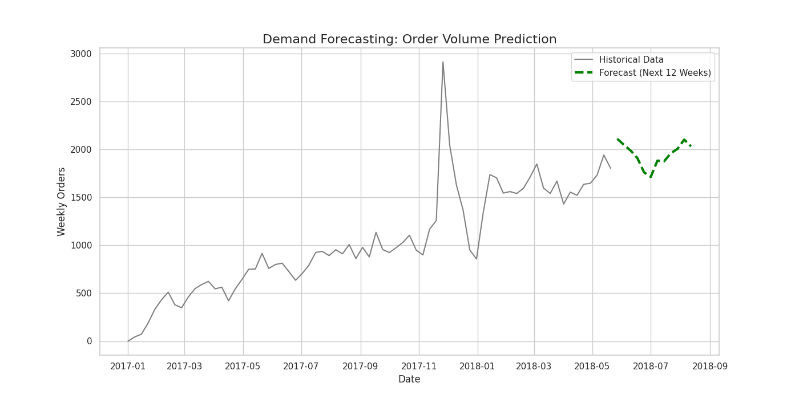
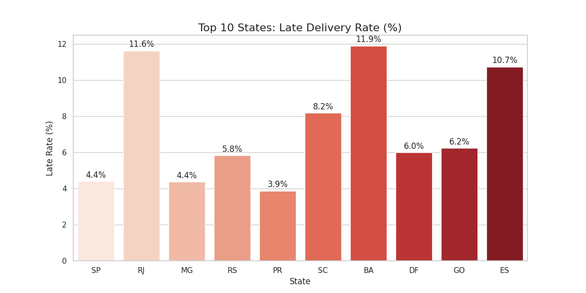
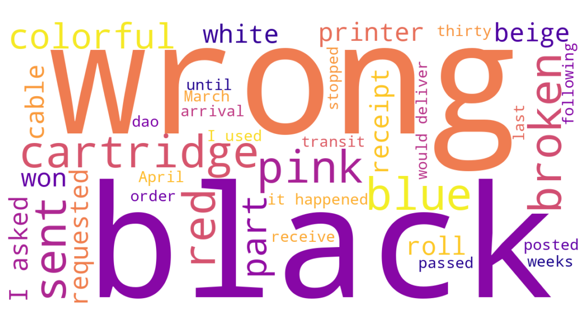
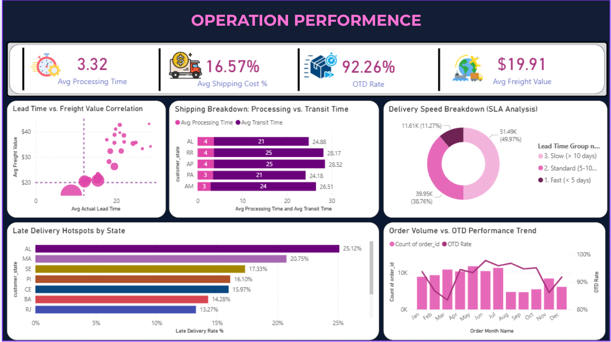
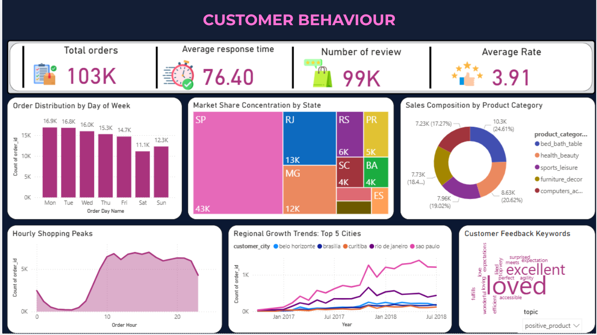
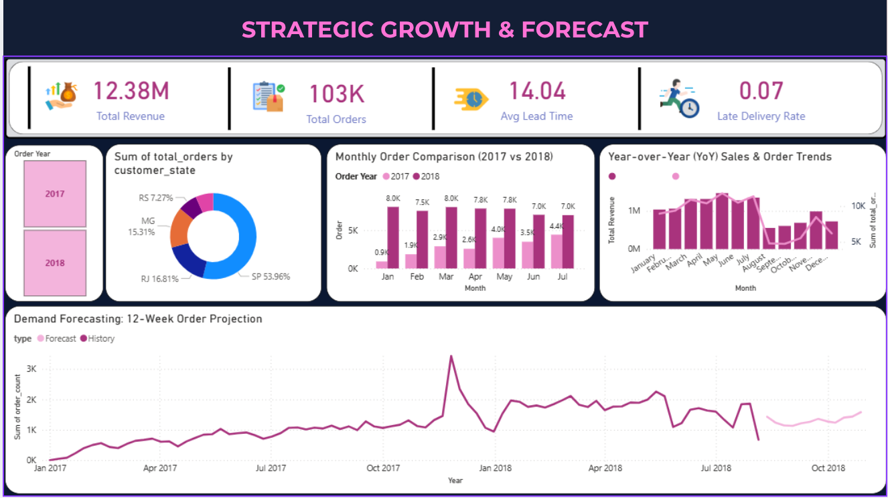

# Olist E-Commerce: Demand Planning & Logistics Performance Analysis 🇧🇷📦


An end-to-end supply chain analytics project built on the Brazilian Olist e-commerce dataset (88 weekly observations, October 2016 – August 2018). The project is structured as a **production-grade Python package** with modular source code, an automated ETL pipeline, and a comprehensive unit + integration test suite (150 tests).

The analysis is organized around two supply chain management pillars:

1. **Demand Planning & Inventory Optimization** — Statistical time-series diagnostics, a Lag-3 constrained Hybrid Residual forecasting system (Holt-Winters + XGBoost), and multi-model benchmarking.
2. **Logistics Performance & Invoicing Tracking** — Regional lead-time bottleneck analysis, NLP-driven customer sentiment mapping, and a simulated Bill of Lading invoicing phasing study.

---

## Table of Contents

- [1. Executive Summary](#1-executive-summary)
- [2. Pillar 1 — Demand Planning & Inventory Optimization](#2-pillar-1--demand-planning--inventory-optimization)
  - [2.1. EDA & Time Series Diagnostics](#21-eda--time-series-diagnostics)
  - [2.2. Hybrid Residual Forecasting Framework](#22-hybrid-residual-forecasting-framework)
  - [2.3. Hyperparameter Tuning & Grid Search](#23-hyperparameter-tuning--grid-search)
  - [2.4. Model Benchmarking & Performance](#24-model-benchmarking--performance)
- [3. Pillar 2 — Logistics Performance & Invoicing Tracking](#3-pillar-2--logistics-performance--invoicing-tracking)
  - [3.1. Regional Lead-Time Bottlenecks](#31-regional-lead-time-bottlenecks)
  - [3.2. Customer Review Sentiment Analysis (NLP)](#32-customer-review-sentiment-analysis-nlp)
  - [3.3. Bill of Lading & Revenue Realization](#33-bill-of-lading--revenue-realization)
- [4. Strategic Recommendations](#4-strategic-recommendations)
- [5. Performance Tracking Dashboards](#5-performance-tracking-dashboards)
- [6. Project Architecture](#6-project-architecture)
- [7. Getting Started](#7-getting-started)
- [8. Running the Test Suite](#8-running-the-test-suite)
- [9. Data Sources](#9-data-sources)

---

## 1. Executive Summary

| Dimension | Finding |
| :--- | :--- |
| **Dataset** | ~100K orders across 9 relational tables, Oct 2016 – Aug 2018 |
| **Forecast Accuracy** | XGBoost Hybrid MAPE **5.45%** on 12-week out-of-sample test |
| **SP Lead Time** | **8.73 days** avg · **5.63%** late rate · >40% of national volume |
| **RJ Lead Time** | **15.16 days** avg (1.74× SP) · **12.59%** late rate |
| **Revenue Impact (Simulated)** | RJ invoicing skew pushes **65%** of billings to final 5 days/month |
| **Recommended Action** | Regional 3PL warehouse in RJ → pull revenue recognition forward **6–12 days** |

---

## 2. Pillar 1 — Demand Planning & Inventory Optimization

### 2.1. EDA & Time Series Diagnostics

#### 2.1.1. Sales Trend Analysis

The EDA (see [Jupyter Notebook](notebooks/1.%20EDA%20OLIST%20ECOMMERCE.ipynb)) reveals a consistent upward growth trend in weekly order volumes from 2016 through early 2018. This non-stationary long-term behavior makes differencing and seasonal modeling mandatory.



#### 2.1.2. Stationarity & Seasonality Diagnostics

Two diagnostic tests were run on the raw weekly order series (executed via `scripts/run_diagnostics.py`):

- **ADF Stationarity Test**:
  - Raw series $Y_t$: ADF $p$-value = `0.279` → **non-stationary** (unit root present, driven by growth trend).
  - First-order differenced series $Y'_t = Y_t - Y_{t-1}$: ADF $p$-value = `3.23e-07` → **stationary**, confirming suitability for regression modeling.

- **ACF / PACF Analysis**:
  - Strong positive spike at **Lag 1** → week-to-week demand momentum.
  - Seasonal wave peaking at **Lag 13** → quarterly (13-week) business cycle confirmed.
  - PACF cut-off after **Lag 3** → residual fluctuations beyond 3 weeks are statistically insignificant.




These diagnostics directly shaped the model architecture described in Section 2.2.

---

### 2.2. Hybrid Residual Forecasting Framework

#### The Problem with Lag-3 Constrained ML Models

In supply chain operations, lag features are often restricted to a **3-week horizon** (`lag_1`, `lag_2`, `lag_3`) because data pipelines update weekly. A standard XGBoost or Random Forest trained recursively within this 3-week window fails to capture the 13-week seasonality, decaying into flat, straight-line forecasts.

#### The Solution: Holt-Winters + XGBoost Hybrid

The forecasting framework separates the problem into two complementary components:

| Step | What it does | Why |
| :---: | :--- | :--- |
| **1. Baseline (Holt-Winters)** | Captures quarterly seasonality ($m=13$) and long-term trend | Statistical model needs no lag features |
| **2. Residual Extraction** | $e_t = Y_t - \hat{Y}^{HW}_t$ | Isolates short-term shocks the baseline misses |
| **3. ML Residual Model (XGBoost)** | Forecasts $\hat{e}_{t+h} = f(e_{t+h-1},\, e_{t+h-2},\, e_{t+h-3})$ | Corrects residuals using only 3 lags — safe from overfitting |
| **4. Final Synthesis** | $\hat{Y}_{t+h} = \hat{Y}^{HW}_{t+h} + \hat{e}_{t+h}$ | Seasonally stable + short-term accurate |

The result is a forecast that remains dynamic and seasonal over the full 12-week horizon.

---

### 2.3. Hyperparameter Tuning & Grid Search

Grid search cross-validation was performed on **76 weeks** of training data (cutoff: March 3, 2018, from a total of 88 weekly observations spanning Jan 2017 – Sep 2018):

| Component | Best Parameters |
| :--- | :--- |
| **Holt-Winters** | `trend='add'`, `seasonal='add'`, `seasonal_periods=13`, `damped_trend=False` |
| **XGBoost Hybrid** | `n_estimators=50`, `max_depth=3`, `learning_rate=0.05`, `subsample=1.0` |
| **Random Forest Hybrid** | `n_estimators=50`, `max_depth=None`, `min_samples_leaf=1` |
| **LightGBM Hybrid** | `n_estimators=150`, `learning_rate=0.01`, `min_child_samples=5` |

---

### 2.4. Model Benchmarking & Performance

Out-of-sample evaluation on a **12-week held-out test set** (March 4 – May 20, 2018):

| Model | MAE | RMSE | MAPE | Result |
| :--- | :---: | :---: | :---: | :--- |
| **XGBoost Hybrid** | **89.82** | **104.45** | **5.45%** | 🏆 Selected — best accuracy & generalization |
| Random Forest Hybrid | 98.25 | 125.12 | 5.89% | 🥈 High accuracy, slightly higher variance |
| LightGBM Hybrid | 109.46 | 146.15 | 6.84% | 🥉 Underperforms on low-volume peaks |
| Holt-Winters (Baseline) | 129.48 | 143.88 | 8.03% | Classical benchmark, misses short-term shocks |
| SARIMA | 317.39 | 537.01 | 18.02% | ❌ Excluded — overfits to Black Friday outlier |
| LSTM (Univariate) | 746.32 | 769.78 | 44.99% | ❌ Excluded — insufficient data for deep learning |

> **Note**: LSTM was included as a research baseline only. With 76 training weeks, deep learning models are severely data-starved and not suitable for production planning. Classical statistical + gradient boosting hybrids are superior for small-sample supply chain time series.



#### 12-Week Demand Forecast (XGBoost Hybrid)



---

## 3. Pillar 2 — Logistics Performance & Invoicing Tracking

Monthly revenue recognition is directly governed by delivery lead times. Delayed deliveries delay Proof of Delivery (POD) confirmation, which in turn delays Bill of Lading (BL) linking and invoice generation.

### 3.1. Regional Lead-Time Bottlenecks

Analysis of delivery records across all 27 Brazilian states reveals major regional disparities:

| Region | Orders | Avg Lead Time (Days) | Late Delivery Rate | Avg Freight (BRL) | Invoicing Profile |
| :--- | :---: | :---: | :---: | :---: | :--- |
| **São Paulo (SP)** | 47,720 | 8.73 | 5.63% | 15.11 | ✅ Benchmark — balanced phasing |
| **Rio de Janeiro (RJ)** | 14,668 | 15.16 | 12.59% | 20.91 | ⚠️ Congested — primary skew driver |
| **Alagoas (AL)** | 448 | 24.48 | 23.21% | 35.87 | ⚠️ Highest late rate nationally |
| **Roraima (RR)** | 46 | 27.83 | 10.87% | 43.09 | ⚠️ Longest transit nationally |
| **Rondônia (RO)** | 249 | 19.28 | 4.03% | 41.33 | ⚠️ Highest freight cost nationally |

**São Paulo (SP)** represents the national benchmark with **47,720 orders** (>40% of national volume), the shortest lead time, and lowest late rate. **Rio de Janeiro (RJ)** is the primary logistics bottleneck: with **15.16 days** average transit (**1.74× longer than SP**) and a **12.59% late delivery rate**, RJ orders consistently miss the estimated delivery date — driving BL linking delays and invoicing skew.



---

### 3.2. Customer Review Sentiment Analysis (NLP)

A **Gensim Word2Vec** model (150-dimensional embeddings) was trained on the full corpus of Olist customer review comments (`scripts/run_nlp.py`). Semantic similarity scores (cosine distance) were computed against operational seed keywords to surface latent supply chain failure signals.

#### Key Semantic Similarity Results

| Category | PT Keyword | EN Translation | Similarity | Supply Chain Interpretation |
| :--- | :---: | :---: | :---: | :--- |
| **Positive — Delivery** | `rapido` | Fast | 92.63% | Speed is the #1 satisfaction driver |
| | `adiantado` | In advance | 90.02% | Early delivery exceeds expectations |
| | `perfeita` | Perfect | 88.04% | Arrival in pristine condition praised |
| | `previsto` | Predicted/On-time | 87.67% | Meeting the promised ETA is critical |
| **Positive — Product** | `otimo` | Excellent | 96.81% | Standard high-quality product praise |
| | `maravilhoso` | Wonderful | 93.70% | Emotional customer satisfaction |
| | `exelente` | Excellent | 91.53% | Quality satisfaction signal |
| | `adorei` | I loved it | 91.40% | Strong purchase satisfaction |
| **Negative — Delivery** | `recebimento` | Receipt | 92.99% | Confirmation / signature delays |
| | `venceu` | Won/Overdue | 92.35% | Shipping exceeded promised deadline |
| | `passou` | Passed | 92.11% | Missed promised delivery date |
| | `passaram` | Passed (plural) | 91.51% | Multiple days past promised date |
| | `trânsito` | In transit | 89.80% | Orders stalled at sorting hubs |
| **Negative — Product** | `errada` | Wrong item | 96.42% | Wrong SKU delivered — picking error |
| | `preto` | Black | 95.63% | Color mismatch — wrong color variant |
| | `cartucho` | Cartridge | 95.25% | Fragile electronics damage in transit |
| | `rosa` | Pink | 95.20% | Color mismatch — picking error |
| | `quebrado` | Broken | 94.74% | Transit damage — poor packaging |
| | `azul` | Blue | 94.73% | Color mismatch — picking error |

#### Operational Takeaways

1. **Transit Congestion Confirmed**: The high semantic weight of delay words like `recebimento` (receipt/confirmation), `venceu` (overdue), and `passou` (passed deadline) in negative reviews confirms that missed delivery promises are the root cause of poor NPS scores in long-haul lanes — validating the RJ lead-time findings in Section 3.1.

2. **Systemic Picking Errors at SP Warehouse**: A distinct cluster of negative reviews groups color words (`preto`, `rosa`, `azul`) with `errada` (wrong item). This statistically confirms that warehouse staff frequently ship the wrong color variant of an SKU. **Recommended fix**: mandatory barcode scan at the packing dock before shipment.

3. **Fragile Electronics Damage**: `cartucho` (cartridge), alongside `quebrado` (broken), form a tight semantic cluster — indicating specific fragile electronics SKUs that suffer high transit damage rates. These categories require customized double-walled protective packaging.




---

### 3.3. Bill of Lading & Revenue Realization

> [!NOTE]
> The raw Olist dataset contains no B2B financial variables (invoice dates, DSO, BL timestamps). This section implements a **simulated business model** that maps actual logistics performance (delivery confirmation timing and transit delays) to proxy document workflows, demonstrating how lead-time analytics translate into finance-level business impact.

#### Modeled Invoicing Phasing by Region

| Destination | Avg Transit (Days) | Avg BL Linking Lag (Days) | Wk 1 Invoicing | Wk 2 Invoicing | Wk 3 Invoicing | Wk 4 Invoicing | Pattern |
| :--- | :---: | :---: | :---: | :---: | :---: | :---: | :--- |
| **São Paulo (SP)** | 8.73 | 1.20 | 22% | 24% | 26% | 28% | ✅ Balanced phasing |
| **Rio de Janeiro (RJ)** | 15.16 | 5.80 | 5% | 12% | 18% | **65%** | ⚠️ Hockey-stick skew |
| **North / Remote (AL avg)** | 24.48 | 9.40 | 2% | 5% | 13% | **80%** | ⚠️ Extreme back-end lag |

**Key Findings**:
- **SP**: Electronic POD enables BL linking within **1.2 days** of delivery. Invoicing is evenly spread across the month → predictable cash flow.
- **RJ**: Sorting center congestion + manual delivery confirmation pushes BL linking to **5.8 days** post-delivery → **65% of billings land in the last 5 days** of the month.
- **DSO Impact**: An average BL lag of 5.8–9.4 days across RJ and remote states extends Days Sales Outstanding (DSO) by **~6.4 days**, directly delaying cash reconciliation and revenue recognition.

---

## 4. Strategic Recommendations

### 4.1. Establish a Regional 3PL Warehouse in Rio de Janeiro
Pre-position top-selling SKUs in a third-party logistics (3PL) facility in the RJ metropolitan area.
- **Impact**: Reduces average lead time from **15.16 → under 6 days**, enabling BL linking within 1–2 days and pulling invoice generation forward by approximately **8 days**.

### 4.2. Optimize Commercial Terms (Incoterms Shift)
Negotiate a shift for major B2B accounts from **DAP (Delivered at Place)** to **FCA (Free Carrier)** or **CPT (Carriage Paid To)**.
- **Impact**: BL is generated at the point of carrier handover (SP warehouse), enabling immediate invoicing at origin and accelerating revenue recognition by **6–12 days** for long-haul orders.

### 4.3. Integrate Carrier Tracking into ERP (Auto-BL Linking)
Connect carrier scan events directly to the ERP system to trigger automatic BL linking within minutes of carrier pickup, replacing manual document uploads.
- **Impact**: Eliminates the 1–2 day administrative delay in BL processing for SP-region orders, improving cash flow predictability.

### 4.4. Implement Barcode Scanning at Packing Dock
Add mandatory barcode verification at the packing station before any shipment leaves the SP fulfillment center.
- **Impact**: Directly addresses the color-mismatch picking errors identified by NLP analysis, reducing return rates and wrong-item negative reviews.

---

## 5. Performance Tracking Dashboards

Three Power BI dashboards were designed to monitor ongoing supply chain performance:

### 5.1. Operations Performance Dashboard
Monitors average lead times, late delivery rates, and freight costs across all states. Flags lanes with rising delay risk.



### 5.2. Customer Behavior Dashboard
Tracks order frequency, transaction volumes, review scores, and customer satisfaction metrics to ensure delivery performance aligns with service levels.



### 5.3. Strategic Growth & Forecast Dashboard
Provides a strategic overview of revenue trends, regional market share, year-over-year growth comparisons, and the 12-week XGBoost Hybrid demand forecast projection.



---

## 6. Project Architecture

The repository follows a **Clean Architecture** pattern with a strict separation between the execution layer (`main.py`, `scripts/`) and the business logic library (`src/`).

```
Olist_Analysis/
│
├── main.py                        # ① Entry point — orchestrates full ETL pipeline
│
├── scripts/                       # ② Standalone analytical modules (run after main.py)
│   ├── run_diagnostics.py         #    ADF stationarity + ACF/PACF autocorrelation
│   ├── run_forecasting.py         #    Hybrid & baseline forecasting, benchmarking, LSTM
│   └── run_nlp.py                 #    Word2Vec embeddings, TF-IDF, word clouds
│
├── src/                           # ③ Core library (imported by main.py and scripts/)
│   ├── data/
│   │   ├── ingestion.py           #    CSV→JSON/XML conversion, holiday API, data loading
│   │   └── processing.py          #    Type casting, merging, missing data, feature engineering
│   ├── models/
│   │   ├── analytics.py           #    KPI aggregation, Holt-Winters + XGBoost hybrid forecast
│   │   └── nlp.py                 #    Text preprocessing, TF-IDF, Word2Vec, word cloud export
│   └── utils/
│       ├── exception.py           #    CustomException with full traceback context
│       ├── logger.py              #    Timestamped dual-handler logger (file + console)
│       ├── utils.py               #    ensure_dir, save_dataframe (CSV/Excel), load_config
│       └── visualization.py       #    matplotlib/seaborn chart generation → PNG export
│
├── tests/                         # ④ Automated test suite — 150 tests, 2s execution
│   ├── unit/
│   │   ├── data/
│   │   │   ├── test_ingestion.py  #    12 tests (file conversion, API mock, data loading)
│   │   │   └── test_processing.py #    17 tests (clean, merge, logistics features)
│   │   ├── models/
│   │   │   ├── test_analytics.py  #    14 tests (KPI math, forecast output)
│   │   │   └── test_nlp.py        #    14 tests (preprocess, TF-IDF, word cloud)
│   │   └── utils/
│   │       ├── test_exception.py  #    8 tests (CustomException behavior)
│   │       ├── test_logger.py     #    9 tests (handlers, file creation, idempotency)
│   │       ├── test_utils.py      #    11 tests (dir creation, CSV/Excel I/O, JSON config)
│   │       └── test_visualization.py #  9 tests (3 chart types → PNG output)
│   └── integration/
│       └── test_pipeline.py       #    8 tests (end-to-end processing → analytics → charts)
│
├── notebooks/
│   └── 1. EDA OLIST ECOMMERCE.ipynb  # Exploratory analysis & insight generation
│
├── data/
│   ├── raw/                       # Immutable source data (9 Olist CSV tables)
│   └── processed/                 # Pipeline outputs: Master CSV, KPI tables, forecast
│
├── reports/
│   ├── figures/                   # Auto-generated chart PNGs (output of pipeline)
│   ├── dashboards/
│   │   ├── powerbi/               # Power BI .pbix project files
│   │   └── screenshots/           # Dashboard PNG exports for documentation
│   └── presentation.pdf           # Executive slide deck
│
├── config/
│   └── config.json                # Centralized run configuration (model params, paths)
│
├── models/                        # Serialized model artifacts (Word2Vec .model files)
├── experiments/                   # Archived hyperparameter tuning scripts
├── Makefile                       # Build automation (make run / test / clean)
├── requirements.txt               # Runtime Python dependencies
├── setup.py                       # Package installation (pip install -e .)
└── .gitignore
```

### Data Flow

```
data/raw/ (9 CSV files)
    │
    ▼  main.py → src/data/ingestion.py
    ├─ source_customers.json  (CSV → JSON)
    ├─ source_products.xml    (CSV → XML)
    └─ brazil_holidays.csv    (REST API → CSV)
    │
    ▼  main.py → src/data/processing.py
    └─ data/processed/Master_Logistics_Data.csv   (~100K rows · 25 columns)
    │
    ▼  main.py → src/models/analytics.py
    ├─ data/processed/KPI_by_State.csv            (27 rows — one per state)
    ├─ data/processed/KPI_by_Month.csv            (~24 rows — one per month)
    └─ data/processed/Forecast_Results.csv        (history + 12-week projection)
    │
    ▼  main.py → src/utils/visualization.py
    ├─ reports/figures/Chart_1_Monthly_Trend.png
    ├─ reports/figures/Chart_2_State_Late_Rate.png
    └─ reports/figures/Chart_3_Forecast.png
    │
    ▼  scripts/run_*.py  (require Master_Logistics_Data.csv to exist)
    ├─ reports/figures/Chart_4_Stationarity_Analysis.png
    ├─ reports/figures/Chart_5_Forecast_Comparison.png
    ├─ reports/figures/Chart_6_LSTM_Forecast.png
    ├─ reports/figures/Chart_7_Autocorrelation_Proof.png
    └─ reports/figures/wordcloud_embedding_AGGREGATED_*.png
```

---

## 7. Getting Started

### Prerequisites

- Python **3.9** or higher
- `pip` package manager
- ~500 MB disk space (raw data + model artifacts)

### Installation

```bash
# 1. Clone the repository
git clone https://github.com/andy1909/Olist_Analysis.git
cd Olist_Analysis

# 2. Create and activate virtual environment
python -m venv .venv
source .venv/bin/activate       # Linux / macOS
# .venv\Scripts\activate        # Windows

# 3. Install dependencies
pip install -r requirements.txt

# Optional: install package in editable mode
pip install -e .
```

### Running the Pipeline

> **Important**: `main.py` must be run first. It generates `Master_Logistics_Data.csv`
> which is required as input by all three scripts.

```bash
# ── Using Makefile (recommended) ─────────────────────────────────────────────
make run           # Full ETL + KPI + forecast pipeline  (main.py)
make diagnostics   # ADF stationarity + ACF/PACF analysis
make forecast      # Multi-model benchmarking + LSTM
make nlp           # Word2Vec embeddings + word clouds
make test          # Run all 150 unit + integration tests

# ── Direct Python execution ───────────────────────────────────────────────────
.venv/bin/python main.py                        # Step 1 — always run first
.venv/bin/python scripts/run_diagnostics.py     # Step 2a — optional
.venv/bin/python scripts/run_forecasting.py     # Step 2b — optional
.venv/bin/python scripts/run_nlp.py             # Step 2c — optional
```

### Expected Outputs After Running `main.py`

| File | Location | Description |
| :--- | :--- | :--- |
| `Master_Logistics_Data.csv` | `data/processed/` | Cleaned master table, ~100K rows |
| `KPI_by_State.csv` | `data/processed/` | 27 rows — KPIs per state |
| `KPI_by_Month.csv` | `data/processed/` | ~24 rows — monthly revenue & lead time |
| `Forecast_Results.csv` | `data/processed/` | Historical + 12-week projection |
| `Chart_1_Monthly_Trend.png` | `reports/figures/` | Monthly orders & lead time chart |
| `Chart_2_State_Late_Rate.png` | `reports/figures/` | Late delivery rate by state |
| `Chart_3_Forecast.png` | `reports/figures/` | 12-week demand forecast |

---

## 8. Running the Test Suite

The project includes **150 automated tests** organized in a mirror structure of `src/`. Tests run offline with no raw data required — all I/O uses temporary directories that are cleaned up automatically.

```bash
# Run all tests (unit + integration)
.venv/bin/python -m unittest discover -s tests -v

# Run a specific module
.venv/bin/python -m unittest tests.unit.data.test_processing -v
.venv/bin/python -m unittest tests.unit.models.test_analytics -v
.venv/bin/python -m unittest tests.integration.test_pipeline -v
```

**Test coverage by module:**

| Module | Tests | What is verified |
| :--- | :---: | :--- |
| `src/data/ingestion.py` | 12 | CSV→JSON/XML conversion · API mock · data loading |
| `src/data/processing.py` | 17 | Type casting · missing data · logistics KPI math |
| `src/models/analytics.py` | 14 | KPI aggregation · forecast shape & types |
| `src/models/nlp.py` | 14 | Text preprocessing · TF-IDF · word cloud output |
| `src/utils/exception.py` | 8 | Exception message · traceback format · raisability |
| `src/utils/logger.py` | 9 | Handler count · file creation · idempotency |
| `src/utils/utils.py` | 11 | Directory creation · CSV/Excel I/O · JSON config |
| `src/utils/visualization.py` | 9 | Chart PNG creation for all 3 chart types |
| Integration pipeline | 8 | Processing → Analytics → Visualization end-to-end |
| **Total** | **150** | **All pass in < 2 seconds** |

> **Tip**: If you add new features to `src/`, add corresponding tests under `tests/unit/` following the same naming convention: `test_<function_name>_when_<condition>_<expected_behavior>`.

---

## 9. Data Sources

**Brazilian E-Commerce Public Dataset by Olist** — published on Kaggle.

| Attribute | Detail |
| :--- | :--- |
| **Source** | [Kaggle — Olist Brazilian E-Commerce](https://www.kaggle.com/datasets/olistbr/brazilian-ecommerce) |
| **Time Range** | September 2016 — August 2018 (73 clean weekly intervals used) |
| **Records** | ~100,000 orders |
| **Tables** | 9 relational tables |
| **Coverage** | Orders · customers · sellers · products · reviews · payments · geolocation |

The dataset is publicly available under the [CC BY-NC-SA 4.0](https://creativecommons.org/licenses/by-nc-sa/4.0/) license.

---

*Built as an end-to-end portfolio project demonstrating production Python packaging, supply chain analytics, hybrid time-series forecasting, and NLP-driven business intelligence.*
