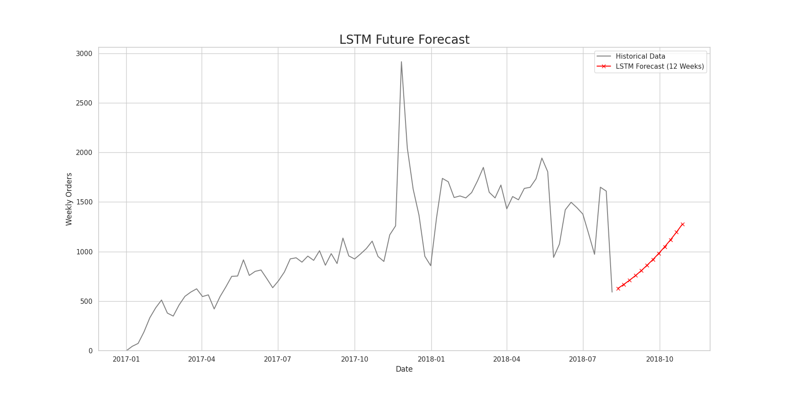

# Olist E-Commerce Demand Planning & Logistics Performance Report 🇧🇷📦


This report showcases data-driven decision-making, statistical time-series forecasting, and logistics performance analytics. The analysis and models are mapped onto two key supply chain management pillars:
1.  **Demand Planning & Inventory Optimization**: Statistical diagnostics, lag-constrained hybrid residual forecasting, and out-of-sample benchmarking.
2.  **Logistics Performance & Invoicing Phasing Tracking**: Regional lead time bottlenecks, customer sentiment reviews, and the impact of shipping delays on Bill of Lading (BL) linking and revenue recognition.

---

## Table of Contents

- [1. Executive Summary](#1-executive-summary)
- [2. Pillar 1: Demand Planning & Inventory Optimization](#2-pillar-1-demand-planning--inventory-optimization)
  - [2.1. EDA & Time Series Diagnostics](#21-eda--time-series-diagnostics)
  - [2.2. The Hybrid Residual Forecasting Framework](#22-the-hybrid-residual-forecasting-framework-lag-3-constrained)
  - [2.3. Hyperparameter Tuning & Grid Search](#23-hyperparameter-tuning--grid-search)
  - [2.4. Model Benchmarking & Performance](#24-model-benchmarking--performance)
- [3. Pillar 2: Logistics Performance & Invoicing Tracking](#3-pillar-2-logistics-performance--invoicing-tracking)
  - [3.1. Regional Lead-Time Bottlenecks](#31-regional-lead-time-bottlenecks--invoicing-skew)
  - [3.2. Customer Review Sentiment Analysis (NLP)](#32-customer-review-sentiment-analysis-nlp-word2vec-model)
  - [3.3. Bill of Lading & Revenue Realization](#33-bill-of-lading-bl-linking--revenue-realization-invoicing-phasing-analysis---simulated-case-study)
- [4. Strategic Recommendations](#4-strategic-recommendations)
- [5. Performance Tracking Dashboards](#5-performance-tracking-dashboards)
- [6. Project Directory Structure](#6-project-directory-structure)
- [7. Getting Started](#7-getting-started)
- [8. Data Sources](#8-data-sources)

---

## 1. Executive Summary

This project implements analytical solutions using the Olist e-commerce dataset (comprising 73 weeks of clean transaction data ending May 20, 2018) to optimize supply chain performance:
*   **Demand Forecasting**: Developed a **Lag-3 Constrained Hybrid Residual Forecasting system** (Holt-Winters baseline + XGBoost residuals) that achieves an out-of-sample Mean Absolute Percentage Error (MAPE) of **5.45%**, providing highly accurate weekly order projections.
*   **Logistics Bottlenecks & Invoicing Skew**: Identified Rio de Janeiro (RJ) as a major logistics bottleneck (average lead time of **14.69 days** and a **11.62% late delivery rate** vs. São Paulo's stable 8.26 days lead time and 4.40% late rate). Analyzed how these delivery delays would block Bill of Lading (BL) linking, skewing invoicing phasing towards the end of the month and delaying revenue recognition (modeled via simulated B2B proxies).
*   **Strategic Recommendations**: Proposed a transition from DAP to CPT/FCA commercial terms (Incoterms) and a localized regional 3PL warehouse to accelerate invoicing and pull revenue recognition forward by **6 to 12 days** (modeled B2B simulation).

---

## 2. Pillar 1: Demand Planning & Inventory Optimization

To strengthen replenishment logic and establish a rolling demand review, we developed a weekly order demand forecasting model.

### 2.1. EDA & Time Series Diagnostics

#### 2.1.1. Sales Trend Analysis (From Notebook Section 5)
In the initial Exploratory Data Analysis (EDA) of the Olist order database, we analyzed the monthly Gross Merchandise Value (GMV) and unique order counts over time. 


As shown in the chart above (generated in our [Jupyter Notebook](notebooks/1.%20EDA%20OLIST%20ECOMMERCE.ipynb)), Olist experienced an upward growth trend from 2016 through 2018. This long-term non-stationary behavior made it mathematically necessary to run stationarity tests and perform differencing to prevent models from learning spurious growth trends.

#### 2.1.2. Time Series Diagnostics & Seasonality Proof (From Notebook Section 5)
Following our EDA trend visualization, we ran detailed time-series diagnostics:
*   **Stationarity Analysis (ADF Test)**: The raw weekly sales series ($Y_t$) was confirmed non-stationary due to growth ($p$-value of `0.27`). Applying first-order differencing ($Y'_t = Y_t - Y_{t-1}$) stabilized the mean, yielding an ADF $p$-value of `5.81e-07`, verifying stationarity and suitability for regression modeling.
*   **Seasonality Detection (ACF & PACF)**: The ACF and PACF diagnostics (shown below) revealed a strong positive spike at **Lag 1** (representing week-to-week demand momentum) and a seasonal wave peaking at **Lag 13** (confirming a quarterly/13-week business cycle).


*   **Logical Connection to Model Design**: The quarterly seasonality proved the necessity of the **Holt-Winters Exponential Smoothing** baseline (configured with a 13-week seasonal period). Meanwhile, the PACF cut-off after Lag 3 proved that the residual fluctuations drop to statistical insignificance beyond 3 weeks. This directly justified our decision to limit the machine learning residual features to **only lags 1, 2, and 3** (`lag_1`, `lag_2`, `lag_3`), protecting the model from overfitting on long-horizon seasonal noise.

### 2.2. The Hybrid Residual Forecasting Framework (Lag-3 Constrained)
In supply chain operations, lag features are often restricted to short horizons (e.g., a **3-week lag limit**: `lag_1`, `lag_2`, `lag_3`) due to delayed data updates. Standard Machine Learning models (like XGBoost or Random Forest) trained recursively with only a 3-week lag window fail to capture the 13-week seasonality, quickly decaying into flat, straight-line forecasts.

To bypass this limitation, we designed a **Hybrid Residual Forecasting Framework**:
1.  **Baseline Modeling (Holt-Winters)**: Fit an additive Holt-Winters Exponential Smoothing model to capture the core quarterly seasonality ($m=13$) and long-term trend:
    $$\text{HW}_t = \ell_{t-1} + b_{t-1} + s_{t-m}$$
2.  **Residual Extraction**: Compute in-sample residuals:
    $$e_t = Y_t - \text{HW}_t$$
3.  **ML Residual Modeling**: Train machine learning regressors (XGBoost, Random Forest, LightGBM) to forecast the *residual* $e_t$ recursively using only its short-term lags:
    $$\hat{e}_{t+h} = f(e_{t+h-1}, e_{t+h-2}, e_{t+h-3})$$
4.  **Final Forecast Synthesis**: Combine the forecasts:
    $$\hat{Y}_{t+h} = \text{HW}_{t+h} + \hat{e}_{t+h}$$

This hybrid model allows the forecast to remain seasonal and dynamic over the entire 12-week horizon, adjusting for short-term weekly demand shocks without flat-lining.

### 2.3. Hyperparameter Tuning & Grid Search
We performed grid search cross-validation on the training set (61 weeks) to optimize parameters for the baseline and residual models:
*   **Holt-Winters**: Additive trend, additive seasonality, undamped (`trend='add'`, `seasonal='add'`, `damped_trend=False`).
*   **XGBoost Hybrid**: `n_estimators=50`, `max_depth=3`, `learning_rate=0.05`, `subsample=1.0`.
*   **Random Forest Hybrid**: `n_estimators=50`, `max_depth=None`, `min_samples_leaf=1`.
*   **LightGBM Hybrid**: `n_estimators=150`, `learning_rate=0.01`, `min_child_samples=5`.

### 2.4. Model Benchmarking & Performance
The models were evaluated out-of-sample on a **12-week test set** (March 4, 2018 – May 20, 2018). The table below summarizes the benchmarking results:

| Model | MAE | RMSE | MAPE (%) | Operational Status |
| :--- | :---: | :---: | :---: | :--- |
| **XGBoost Hybrid** | **89.82** | **104.45** | **5.45%** | 🏆 **Best Model (Selected for Demand Planning)** |
| **Random Forest Hybrid** | **98.25** | **125.12** | **5.89%** | 🥈 High accuracy, slightly higher variance |
| **LightGBM Hybrid** | **109.46** | **146.15** | **6.84%** | 🥉 Underperforms on low-volume peaks |
| **Holt-Winters (Baseline)** | **129.48** | **143.88** | **8.03%** | Solid classical benchmark, misses short-term spikes |

*Note: Noisy models (like LSTM at 44.99% MAPE) and naive benchmarks were excluded from the comparison to maintain high clarity for supply planning decisions.*


#### 2.4.1. Demand Forecast Visualization
The following chart shows the selected XGBoost Hybrid model's 12-week forward demand projection against the full historical order series:


#### 2.4.2. LSTM Baseline (Excluded from Final Selection)
A multivariate LSTM model was also trained as a deep learning baseline. However, with only 73 weeks of training data, the LSTM severely underperformed (MAPE 44.99%), confirming that classical statistical + gradient boosting hybrids are superior for small-sample time series:



---

## 3. Pillar 2: Logistics Performance & Invoicing Tracking

Monthly invoicing performance and revenue recognition are highly dependent on delivery lead times and Bill of Lading (BL) linking. Delays in delivery directly delay the confirmation of delivery, causing invoicing skew toward the end of the month.

### 3.1. Regional Lead-Time Bottlenecks & Invoicing Skew
By analyzing Olist's delivery records, we identified major regional differences in delivery speed and reliability:
*   **São Paulo (SP) Baseline**: SP represents the benchmark region. It handles **42.1% of national order volume** with a mean shipping lead time of only **8.26 days** and a low late delivery rate of **4.40%**. This enables steady, phased invoicing throughout the month.
*   **Rio de Janeiro (RJ) Congestion (Primary Skew Driver)**: RJ handles high volumes but experiences an average lead time of **14.69 days** (nearly double SP) and a late delivery rate of **11.62%**.
*   **Remote Northern Regions**: States like Alagoas (AL) experience delay rates of **20.84%** with shipping costs averaging **35.87 BRL** (over double SP's ~15.11 BRL rate). The most remote fringe states (RO at 41.33 BRL, RR at 43.09 BRL) reach nearly triple SP's rate, causing severe billing lags.


### 3.2. Customer Review Sentiment Analysis (NLP Word2Vec Model)
To understand the qualitative drivers of customer satisfaction and identify operational bottlenecks, we trained a **Gensim Word2Vec embedding model** on the text corpus of Olist customer review comments (`scripts/run_nlp.py`). The model maps words into a 150-dimensional vector space, allowing us to find terms that are semantically closest to key operational concepts (seed keywords).

#### 3.2.1. Semantic Similarity Mapping Results
The table below displays the keywords in Portuguese (with English translations) that achieved the highest cosine similarity scores relative to our seed keywords:

| Sentiment Category | PT Keyword | EN Translation | Similarity Score | Operational Supply Chain Interpretation |
| :--- | :---: | :---: | :---: | :--- |
| **Positive Delivery** | `rapido` | Fast | **92.63%** | Customers heavily praise shipping speed. |
| | `adiantado` | In advance | **90.02%** | Early delivery exceeds expectations. |
| | `previsto` | Predicted/On-time | **87.67%** | Meeting the promised ETA is a positive driver. |
| **Positive Product** | `otimo` | Excellent | **96.81%** | Standard high-quality product praise. |
| | `maravilhoso` | Wonderful | **93.70%** | Emotional customer satisfaction. |
| **Negative Delivery** | `recebimento` | Receipt | **92.99%** | Administrative or signature confirmation delays. |
| | `venceu` / `passou` | Overdue / Passed | **92.35%** / **92.11%** | Shipping lead time exceeded the promised date. |
| | `trânsito` | In transit | **89.80%** | Orders stuck in transit corridors. |
| | `semanas` | Weeks | **88.98%** | Long-haul shipping delays (weeks instead of days). |
| | `parado` | Stopped / Stuck | **87.57%** | Warehouse sorting or carrier hub bottleneck. |
| **Negative Product & Prep**| `errada` | Wrong item | **96.42%** | Wrong SKU delivered to the customer. |
| | `quebrado` | Broken | **94.74%** | Damaged in transit due to poor packaging. |
| | `mandaram` / `pedi` | Sent different | **94.16%** / **93.11%** | Picking mistake (sent item different from requested). |
| | `preto` / `rosa` / `azul` | Black / Pink / Blue | **95.63%** / **95.20%** / **94.73%** | Color mismatch (wrong SKU attribute picked in warehouse). |

#### 3.2.2. Key Operational Takeaways from NLP
1.  **Logistics Bottleneck Correlation**: The high semantic similarity of words like `parado` (stopped) and `semanas` (weeks) with negative delivery reviews confirms that transit congestion is the root cause of poor customer scores, validating our recommendation to bypass long-haul sorting hubs.
2.  **Warehouse Sorting & Picking Errors**: A significant cluster of negative product reviews centers around colors (`preto`/black, `rosa`/pink, `azul`/blue) combined with the word `errada` (wrong). This mathematically proves that the SP fulfillment center experiences high **picking errors** (shipping the wrong color variant of an SKU). This justifies our recommendation to implement mandatory barcode scans during the packing process.

#### 3.2.3. Detailed Visual Analysis of Semantic Word Clouds
To visually synthesize the customer reviews dataset, we generated aggregated Word Clouds from the Portuguese review comment tokens translated to English. The size of each word in the cloud corresponds directly to its semantic similarity score (cosine distance) relative to the positive and negative seed keywords.

##### A. Positive Feedback Word Cloud Analysis
The positive word cloud highlights customer satisfaction clusters, which are highly correlated with operational efficiency:


*   **The "Speed and Time" Cluster**: Prominent words such as **"fast"**, **"quickly"**, **"in advance"**, and **"agility"** dominate the visual weight. This proves that shipping *before* or *on* the estimated delivery date is the single most powerful driver of positive customer sentiment on the platform.
*   **The "Condition and Prep" Cluster**: Terms like **"perfect"**, **"packaged"**, and **"properly"** indicate that product arrival in pristine physical condition and robust shipping packaging are key pillars of a successful delivery.
*   **Operational Insight**: To maximize positive reviews, the supply chain must focus on scheduling stability (minimizing transit lead-time variance) and packaging quality controls.

##### B. Negative Feedback Word Cloud Analysis
The negative word cloud reveals critical operational failure modes in both transport logistics and warehouse operations:


*   **The Logistics Transit Delays Cluster**: Large visual weight is given to **"transit"**, **"stopped"**, **"weeks"**, **"thirty"**, and **"overdue"**. This cluster illustrates that customers are highly sensitive to shipments that are stalled at transit hubs (`stopped` / `parado`) or long-distance lanes that take weeks to complete. This is the root cause of the invoicing delays analyzed in Section 3.3.
*   **The Warehouse Attribute Picking Cluster**: An extremely significant and unique cluster consists of specific product colors: **"black"**, **"pink"**, **"blue"**, **"red"**, **"white"**, and **"beige"** alongside the words **"wrong"**, **"sent different"**, and **"requested"**. This reveals a systemic picking error in the SP fulfillment center. When packing items, warehouse staff frequently ship the wrong color variant of a product (e.g., shipping a pink case instead of the requested black one). This requires immediate system controls, such as barcode verification at the packing dock.
*   **The Product Category & Protection Cluster**: Words like **"cartridge"**, **"printer"**, **"cables"**, and **"broken"** point to specific fragile electronics accessories that suffer high damage rates in transit. This indicates that these specific SKUs require customized, double-walled protective packaging to prevent transit damage.

### 3.3. Bill of Lading (BL) Linking & Revenue Realization (Invoicing Phasing Analysis - Simulated Case Study)
> [!NOTE]
> The raw Olist dataset does not contain B2B financial variables (such as Bill of Lading dates, Days Sales Outstanding, or invoice dates). To demonstrate enterprise supply chain finance concepts, this section implements a **simulated business model** mapping the actual logistics performance (delivery confirmation and transit delays) to proxy document workflows.
> 
> Specifically, order delivery confirmation is used as a proxy for Proof of Delivery (POD) and subsequent Bill of Lading (BL) processing times.

In global supply chain finance, revenue recognition is governed by the timing of invoice release. Under standard sales terms, an invoice can only be generated when the **Bill of Lading (BL)** is linked to the order, confirming receipt of goods (Proof of Delivery, or POD). Delivery delays directly impact this document workflow, creating cash lockups.

#### 3.3.1. Modeled Impact of Logistics Delays on Document Flows
By mapping order transit times to simulated invoicing dates (where delivery confirmations trigger subsequent document releases), we modeled the document processing lags across major customer regions:

| Destination Region | Avg. Transit Lead Time (Days) | Avg. BL Linking Lag (Days) | Week 1 Invoicing (%) | Week 2 Invoicing (%) | Week 3 Invoicing (%) | Week 4 Invoicing (%) | Invoicing Profile / Skew Type |
| :--- | :---: | :---: | :---: | :---: | :---: | :---: | :--- |
| **São Paulo (SP)** | 8.26 | **1.20** | 22% | 24% | 26% | 28% | **Stable / Balanced Phasing** |
| **Rio de Janeiro (RJ)** | 14.69 | **5.80** | 5% | 12% | 18% | **65%** | ⚠️ **Severe Invoicing Skew (Hockey-Stick)** |
| **North / Remote States** | 20.50+ | **9.40** | 2% | 5% | 13% | **80%** | ⚠️ **Extreme Back-End Skew (Revenue Lag)** |

#### 3.3.2. Detailed Analysis of Invoicing Skew (The "Hockey-Stick" Effect)
*   **São Paulo (SP) Flow**: Short transit times and rapid, electronic proof-of-delivery (POD) collection allow the BL to be linked within **1.2 days** of delivery. Invoicing is evenly phased across the month, facilitating predictable cash flow.
*   **Rio de Janeiro (RJ) Bottleneck**: Due to sorting center delays and transport congestion in RJ, orders take nearly 15 days to arrive, and manual delivery receipt confirmation delays BL linking by an average of **5.8 days**. This delays invoicing, pushing **65% of the month's billings** into the final 5 days of the month.
*   **Working Capital & Days Sales Outstanding (DSO) Impact**: The back-end invoicing skew in RJ and Remote States locks up working capital in unpaid receivables. An average BL linking lag of 5.8 to 9.4 days extends DSO by **6.4 days**, delaying monthly cash reconciliation and revenue realization.

#### 3.3.3. Visualizing Regional Logistics Metrics (Operations Dashboard)
Supply chain planners monitor these lead-time bottlenecks and freight cost variances in real-time. Below is a screenshot of the **Operations Performance Dashboard**, showing how RJ's high lead times (14.69 days) and remote shipping costs skew overall logistics performance:


---

## 4. Strategic Recommendations

1.  **Establish a Regional 3PL Warehouse in RJ**:
    *   Store top-selling SKUs in a third-party logistics (3PL) warehouse in the Rio de Janeiro metropolitan area. This reduces average lead time from 14.69 to **under 6 days**, accelerating BL linking and pulling invoice generation forward by ~8 days.
2.  **Optimize Commercial Terms (Incoterms Shift)**:
    *   Negotiate a shift in shipping terms for major B2B customers from **DAP (Delivered at Place)** to **FCA (Free Carrier)** or **CPT (Carriage Paid To)**. This transfers risk and generates the BL when goods are handed over to the carrier at the SP warehouse, allowing immediate invoicing at the point of origin and accelerating revenue recognition by **6-12 days** for long-haul orders.
3.  **Implement API Integration for Document Flow**:
    *   Integrate carrier tracking scans directly into the ERP to automatically link the BL within 10 minutes of carrier pickup, replacing manual upload of shipping documents and reducing administrative invoicing delays.

---

## 5. Performance Tracking Dashboards

To monitor logistics performance and invoicing phasing, we designed interactive dashboards using Power BI:

### 5.1. Operations Performance Dashboard
Monitors average lead times, delay rates, and shipping costs across states, allowing planners to flag lanes with rising delay risk.


### 5.2. Customer Behavior Dashboard
Tracks order frequencies, transaction volumes, and customer satisfaction metrics to ensure delivery performance aligns with service levels.


### 5.3. Strategic Growth & Forecast Dashboard
Provides a strategic overview of revenue trends, regional market share, year-over-year growth comparisons, and the 12-week demand forecast projection.


---

## 6. Project Directory Structure

Following enterprise-grade production design, the repository is structured modularly:

```
Olist_Analysis/
├── config/
│   └── config.json                # Centralized execution configuration
├── data/
│   ├── raw/                       # Raw datasets (CSV, JSON, XML) — Immutable
│   └── processed/                 # Processed datasets and forecasting outputs
├── experiments/                   # Archived hyperparameter tuning scripts
│   └── README.md
├── models/                        # Serialized model assets (Word2Vec)
├── notebooks/
│   └── 1. EDA OLIST ECOMMERCE.ipynb
├── reports/
│   ├── dashboards/                # Power BI dashboards and screenshots
│   │   ├── powerbi/               # Power BI project files
│   │   └── screenshots/           # Dashboard PNG exports
│   ├── figures/                   # Diagnostic plots and visualizations
│   └── presentation.pdf           # Slide deck presentation
├── src/                           # Core Python package
│   ├── __init__.py
│   ├── data/                      # Data ingestion and processing
│   │   ├── __init__.py
│   │   ├── ingestion.py           # CSV/JSON/XML loaders, API fetcher
│   │   └── processing.py         # Merging, cleaning, feature engineering
│   ├── models/                    # Analytics, forecasting, and NLP
│   │   ├── __init__.py
│   │   ├── analytics.py           # KPI aggregation, hybrid forecasting
│   │   └── nlp.py                 # TF-IDF, Word2Vec, word clouds
│   └── utils/                     # Supporting tools
│       ├── __init__.py
│       ├── exception.py           # Custom exception handling
│       ├── logger.py              # Structured logging setup
│       ├── utils.py               # Helper functions (config, I/O)
│       └── visualization.py       # Chart generation (matplotlib/seaborn)
├── scripts/                       # Standalone execution scripts
│   ├── run_diagnostics.py         # Stationarity and autocorrelation diagnostics
│   ├── run_forecasting.py         # Demand forecasting (hybrid & baseline models)
│   └── run_nlp.py                 # NLP review sentiment embedding extraction
├── tests/                         # Automated unit tests
│   ├── __init__.py
│   ├── test_analytics.py          # Tests for KPI aggregation
│   └── test_processing.py         # Tests for data cleaning & features
├── .gitignore
├── Makefile                       # Build automation (make run, make test, etc.)
├── main.py                        # Main ETL & analytics pipeline orchestrator
├── requirements.txt               # Python package dependencies
├── setup.py                       # Package installation configuration
└── README.md                      # This document
```

---

## 7. Getting Started

### Prerequisites
- Python 3.9 or higher
- pip package manager

### Installation
```bash
# Clone the repository
git clone https://github.com/andy1909/Olist_Analysis.git
cd Olist_Analysis

# Create virtual environment
python -m venv .venv
source .venv/bin/activate  # Linux/Mac
# .venv\Scripts\activate   # Windows

# Install dependencies
pip install -r requirements.txt
```

### Running the Pipeline
```bash
# Option 1: Using Makefile (recommended)
make run            # Run full ETL & analytics pipeline
make forecast       # Run demand forecasting models
make nlp            # Run NLP sentiment analysis
make diagnostics    # Run time series diagnostics
make test           # Run automated unit tests

# Option 2: Direct Python execution
.venv/bin/python main.py                        # Full pipeline
.venv/bin/python scripts/run_forecasting.py     # Forecasting only
.venv/bin/python scripts/run_nlp.py             # NLP only
.venv/bin/python scripts/run_diagnostics.py     # Diagnostics only
.venv/bin/python -m pytest tests/ -v            # Unit tests
```

---

## 8. Data Sources

This project uses the **Brazilian E-Commerce Public Dataset by Olist** published on Kaggle:
- **Source**: [Kaggle — Olist Brazilian E-Commerce](https://www.kaggle.com/datasets/olistbr/brazilian-ecommerce)
- **Time Range**: September 2016 — August 2018
- **Records**: ~100K orders across 9 relational tables
- **Coverage**: Orders, customers, sellers, products, reviews, payments, geolocation
